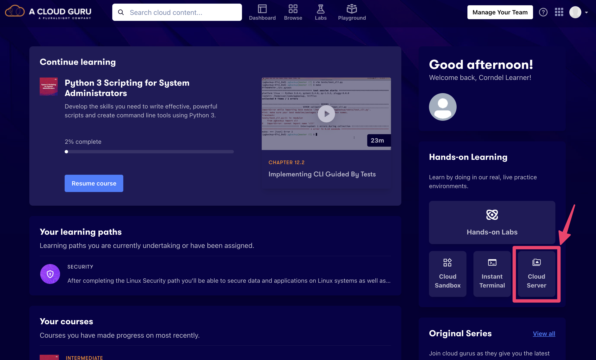
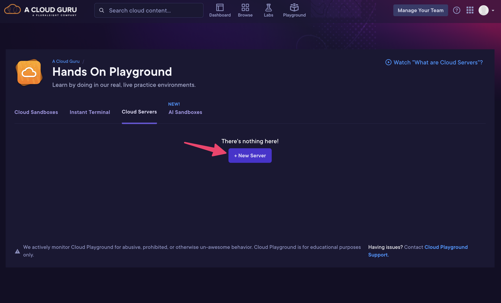
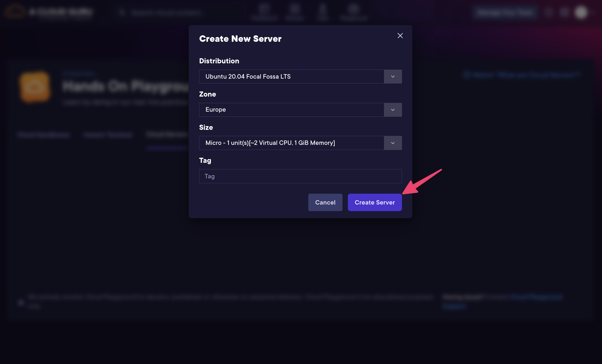
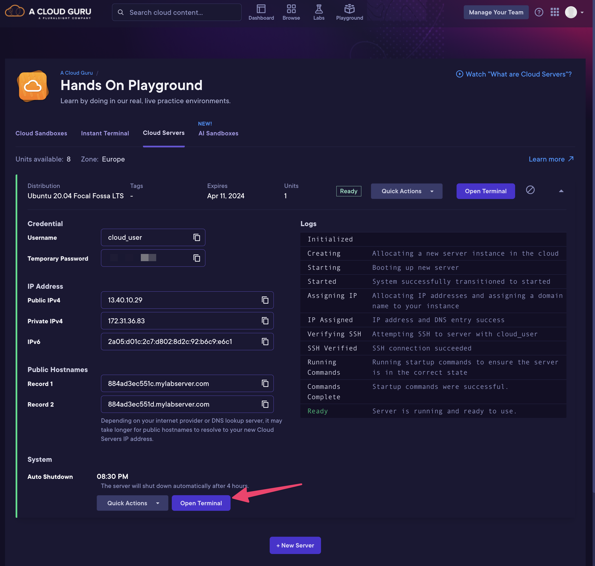
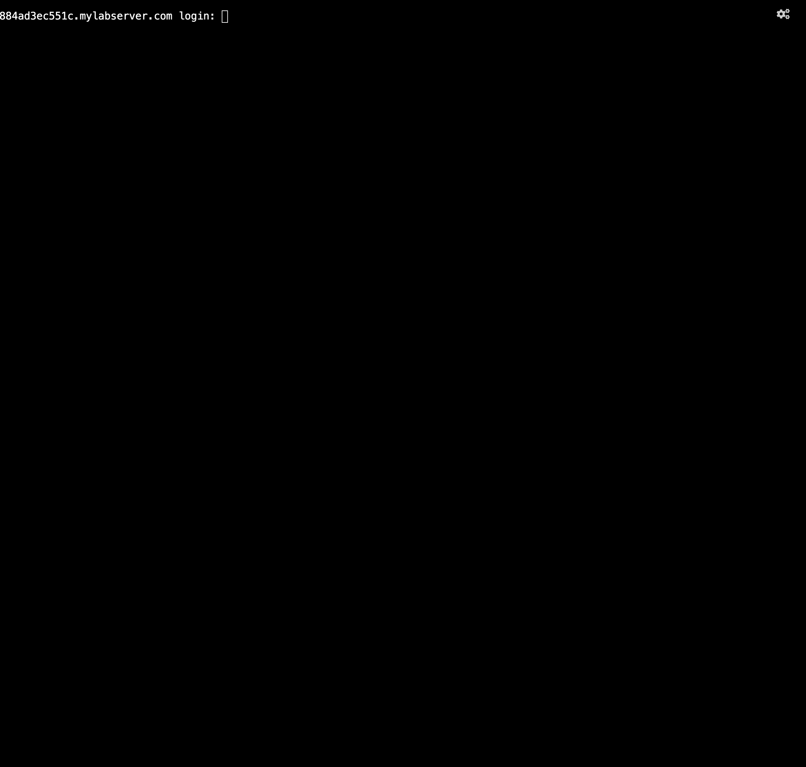
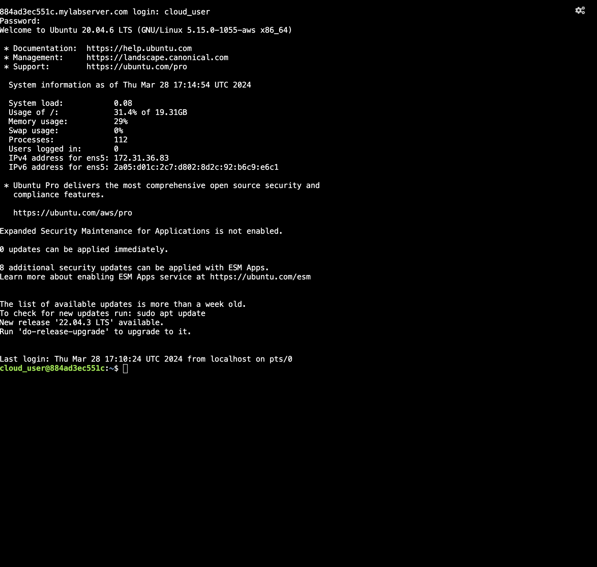
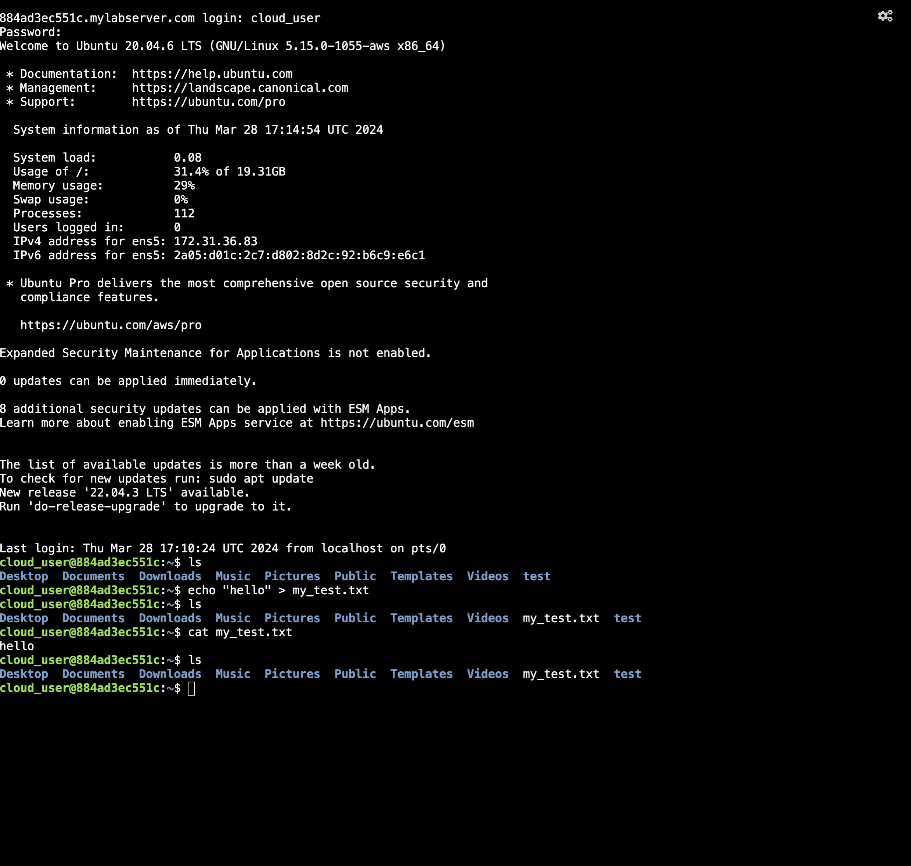

# Setting up and using an ACG cloud server

## Step 1: Log into ACG
You should have your ACG credentials to hand. Navigate to this URL and log in: https://learn.acloud.guru/home

Once logged in, you should see the following home page. Click on the "Cloud Server" button as illustrated.

## Step 2: Creating your server
You should now see the following page. Click on the "New Server" button as illustrated.

You will now see the following dialog. Fill in the details as illustrated. 

You will then see details of a new server appear on the page. You can click the arrow on the right to expand the details. The server will take a few minutes to set up. Once it is fully set up, it should look like the image below. Click on the "Open Terminal" button to proceed (or use SSH if you know how). Make note of the username and password as you will need these to log in.

## Step 3: Logging into your server

You will now see the terminal window open. You can now log in using the username and password provided.

## Step 4: Using your server

You should now see the terminal prompt below. This is your server. You can now use it as you would any other terminal. You can do all our exercises in this terminal, including workshops!

All of the commands you expect should work will work, and it also comes with a relatively recent version of Python. You can also install other things if you need to.

## Step 5 (Unit 1 Workshop): Install necessary tools for Unit 1 Workshop

If you're doing the Unit 1 Workshop, you'll also need to ensure you install the AWS CLI.
Run `sudo snap install aws-cli --classic` (you'll need your password).

## Step 6 (Unit 1 Workshop): Clone the repository

`git` should be pre-installed on the server, so from your home directory (which you can reach with `cd ~`) clone the code down using `git clone https://github.com/corndeladmin/DevOps-Unit-1-Workshop.git` and then enter that directory with `cd DevOps-Unit-1-Workshop`.